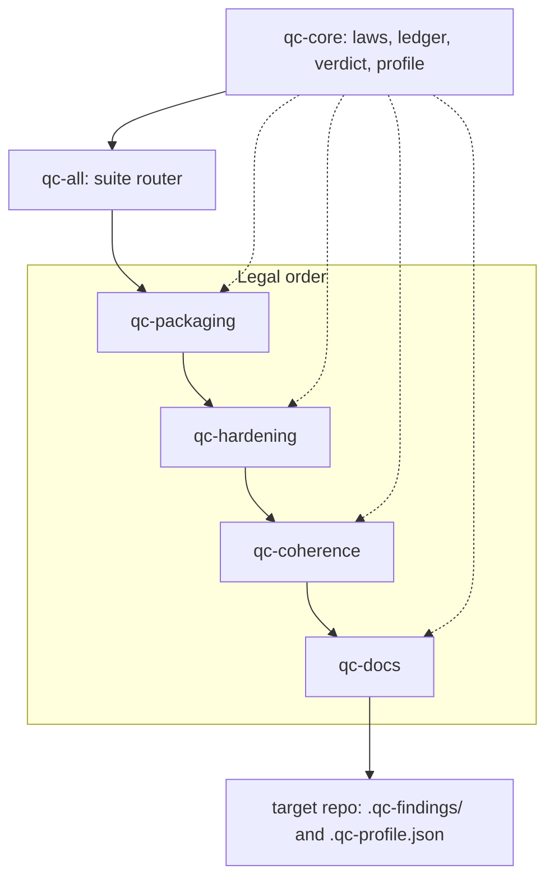

# qc

Quality-control skills for coding agents.

Source: [github.com/dh-repo/qc](https://github.com/dh-repo/qc)

A quality gate for agent-written code before release, merge, or production. Agents often reach feature-complete with tests green while the repo is still not releasable: runtime sequences fail, two backends diverge, packaging is missing, and the README describes a hoped system.

The coding agent follows these `SKILL.md` trees and leaves a findings ledger plus a verdict. This is not a hosted product. Same trees run in Claude Code, Codex, Grok Build, Cursor, Antigravity, and any other client that speaks the [Agent Skills](https://agentskills.io) format. `qc-core` is required; installing a specialization without it is incomplete.



`qc-core` is the shared contract. `qc-all` runs the four specializations in that order. Each specialization loads `qc-core` rather than copying it. A run writes artifacts into the **target** repo, not into this pack.

---

## The six skills

| Skill | Job | Prevents |
|---|---|---|
| `qc-core` | Shared laws, ledger, verdict, profile, Discovery+Verify | Ports and specializations inventing different "ready" meanings |
| `qc-packaging` | Distribution wrap for an existing Python repo | A working codebase that cannot be installed, tested in CI, or released |
| `qc-hardening` | 14-pass audit of residual runtime failure scenarios | Feature-complete code that still breaks on sequences, dual paths, and live adapters |
| `qc-coherence` | Compositional consistency: contracts, names, layers, harvested invariants | Several clean sessions that still leave cross-module drift |
| `qc-docs` | Docs that match the system that exists, including handoff | A next engineer who cannot run, diagnose, recover, or hand off without tribal knowledge |
| `qc-all` | Four specializations in legal order, one suite verdict | Four disconnected runs that drop order and prior-state |

Legal suite order: **qc-packaging → qc-hardening → qc-coherence → qc-docs**. Packaging wraps what exists and must not wait on defect work. Hardening drives residual runtime failures to zero and harvests invariants. Coherence consumes that ledger so it does not rediscover local defects under new ids. Docs run last so the truth-map matches the system that survived. A standalone `/qc-docs` is still legal; docs-before-hardening on a full suite pass is not.

Slash-style triggers once a skill folder is installed: `/qc-core`, `/qc-hardening`, `/qc-coherence`, `/qc-docs`, `/qc-packaging`, `/qc-all`. Agents also pick them up from the `description` frontmatter. A Claude plugin load may namespace the same skill as `/qc:qc-hardening`.

### qc-core

**What.** The shared contract every other skill must load first: seven laws, ledger schema 1.1, verdict math, unified `.qc-profile.json`, Discovery+Verify, and reexam. Specializations own ordered passes and what counts as a finding. This skill owns the invariants they would otherwise copy.

**How.** The agent applies the laws, reads and writes `.qc-profile.json`, writes `.qc-findings/<skill>.json` atomically, and computes the verdict only via `scripts/qc.py`. Scale uses import-graph partitioning; reexam is changed files plus hot-spot neighbors. Scripts such as `verify_ledger.py` recompute artifacts after a run. They do not execute the specializations.

**Why.** Without one contract, each port and each specialization drifts: different ledgers, different deferral codes, different meanings of READY.

**Does not.** Audit a product by itself. Own the 14 hardening passes, coherence lenses, or docs gates. Installing `qc-core` is not a QC pass.

### qc-packaging

**What.** Wrap an existing Python repository for public distribution: packaging metadata, developer tooling, CI, provenance cleanup of packaging files, and a professional landing. Zero functional change.

**How.** First in `qc-all`. Reads the codebase, then pyproject, editorconfig, gitattributes, gitignore, diagrams, README, CI, SECURITY/CHANGELOG, and validate install/lint/tests/build. Writes `.qc-findings/qc-packaging.json`. Open-P0 verdict policy.

**Why.** Working tests plus an unfinished wrap means the repo cannot be installed, built, or presented as a public release.

**Does not.** Change application code, signatures, imports, or test assertions. Add features, create tests that did not exist, or convert Poetry to PEP 621. Not for new-project scaffolding, non-Python repos, or runtime debugging.

### qc-hardening

**What.** Drive residual concrete failure scenarios (call sequences, dual/public paths, live adapters) to zero or explicit deferral, without changing functional behavior. Terminal state: clean Carmack across modules plus a green in-repo Chaos suite.

**How.** Fourteen ordered passes. Mechanical 1–11 remove tool-visible noise. Carmack and Chaos (12–13) prove absences tools miss. Maintainability (14) turns the evidence into a release judgment. Do not skip or reorder. Pass 8 runs twice (8a before the deep passes, 8b after 12–13). Deep findings carry trigger, violated invariant, and observable. Dual-vote to fix; otherwise defer. Presence of any P0, even after the fix, is `NOT_READY`.

| Pass | Name | Job |
|---|---|---|
| 1 | Correctness | Sequences, dual-path API parity, field population, classification completeness, I/O coercion on every ingest path |
| 2 | Security | Secrets, injection, dependency CVEs |
| 3 | Error handling and resilience | External boundaries, resource lifecycle, schema/validation integrity |
| 4 | Type safety and contracts | Type checker, public contracts, linter |
| 5 | Concurrency and async correctness | Shared state, missing `await`, races (skip if no concurrency) |
| 6 | Performance and scale | Algorithmic, I/O, and memory issues with concrete evidence — no micro-opts |
| 7 | Logging and observability | Error logs, secrets/PII in logs, `print()` hygiene |
| 8 | Test coverage gaps | 8a: functional coverage before deep passes; 8b: regression tests for Carmack/Chaos fixes |
| 9 | Documentation accuracy | Docstrings, README, comments match code (docs follow code) |
| 10 | Backward compatibility | Public signatures, behavioral contracts, validation permissiveness (skip if no public API) |
| 11 | Environment, config, and build integrity | Env vars, config, lockfile/deps, CI alignment, containers |
| 12 | Carmack review | First-principles read of every module; five adversarial questions; harvests invariants |
| 13 | Chaos monkey | In-repo adversarial tests (`tests/test_chaos.py`); no-crash / right exception / graceful degradation |
| 14 | Maintainability and consistency | Release judgment plus Consistency / Maintainability / Overall grades |

**Why.** Feature-complete code with a green suite still fails in production on combinations, races, and adapter edges. Linters do not prove those absences.

**Does not.** Add features, redesign architecture, or change public signatures and defaults. Rewrite tests to match buggy code. Run production chaos or Game Days (blast radius is in-repo tests). Manufacture findings on a clean pass. Do not use while feature work is in progress or on a throwaway prototype.

### qc-coherence

**What.** Guarantee compositional consistency: every public contract has complete, aligned implementations; domain concepts use single canonical forms; architectural boundaries are uniform; previously discovered invariants remain enforced. Produces maps and an invariant registry, not one-shot opinions.

**How.** Four sub-audits in order: Structural (S1–S5), Conformance (C1), Semantic (M1–M5), Architectural (A1–A5). Optional `--scope=module` runs MS-1–MS-6 (when 2+ backends exist, MS-4 runs immediately after MS-1). The hardening ledger is prior-state; deferred items are linked, not re-minted. Dual-vote on LLM-assisted lenses. Persist `canonical_forms[]`, `layer_model`, `invariants[]`, and `clusters[]` on the profile.

| Sub-audit | Check | Job |
|---|---|---|
| Structural | S1 Stub detection | `TODO`/`NotImplementedError`/`pass`/`...` in non-abstract production paths |
| Structural | S2 Dead code and dangling references | Orphan exports, unused publics, broken/shadowed imports |
| Structural | S3 Duplication detection | Exact, parametric, and semantic clones |
| Structural | S4 Type coverage | Strict type checker; `Any` and unexplained `# type: ignore` |
| Structural | S5 Unused dependencies | Manifest packages with zero matching imports |
| Conformance | C1 Protocol/implementation matrix | Every interface method present, signed, and observably equivalent across backends |
| Semantic | M1 Naming consistency | One canonical name per domain concept |
| Semantic | M2 Error handling taxonomy | Equivalent conditions raise equivalent exception types |
| Semantic | M3 Serialization round-trip | `deserialize(serialize(x)) == x` and matching keys |
| Semantic | M4 Behavioral contract consistency | Same logical role, same behavior across implementations |
| Semantic | M5 Magic values and implicit constants | Repeated domain literals not named or centralized |
| Architectural | A1 Dependency direction | Import graph vs permitted layer directions |
| Architectural | A2 Layer boundary enforcement | No internals bypass; domain stays free of infrastructure |
| Architectural | A3 Module responsibility | Mixed domains in one module; split is deferred, not executed |
| Architectural | A4 Documented invariants as tests | Comments/ADRs harvested; untested testable invariants are findings |
| Architectural | A5 Cross-cutting concern consistency | Logging, auth, retry, transactions, flags implemented the same way |

| Module scope | Job |
|---|---|
| MS-1 Protocol conformance parity | Same Protocol method, same assertion, every backend |
| MS-2 Responsibility density | Oversized modules accumulating unrelated domains |
| MS-3 Coordination surface | Locks, gates, events, and state-machine comprehensibility |
| MS-4 Backend parity | Feature set and SQL-dialect gaps across alternative stores |
| MS-5 Cross-session consistency | New code reintroducing patterns prior hardening already flagged |
| MS-6 Test architecture | Fixture duplication, parameterization gaps, oversized test files |

**Why.** Several clean feature sessions still leave protocol/backend drift, aliasing, stubs, and layer violations that per-function checks miss. Hardening owns runtime proof of sequences. This skill owns static contracts and canonical forms.

**Does not.** Prove live runtime paths. Redesign the architecture. Treat unexamined modules as coherent. Use during active feature work, or when a targeted hardening pass is the right tool.

### qc-docs

**What.** The minimal complete documentation set that lets a new engineer or operator understand, run, diagnose, recover, and hand off the system that actually exists, including residual debt from prior audits.

**How.** Last in `qc-all`. Reads code plus prior ledgers and the profile. Writes `truth_map[]` before editing. Four gates: Completeness, Accuracy, Clarity, Handoff Readiness. Documents the system as found. Code wins when docs and code disagree.

**Why.** Docs that describe hoped design, omit code-surfaced operator paths, or contradict CLI and config leave the next person stuck.

**Does not.** Invent features, infrastructure, SLAs, or recovery procedures the code does not support. Substitute for packaging, hardening, or feature work. Leave empty template files. Turn the README into the full runbook.

### qc-all

**What.** The suite router: legal order, skip logic, watch manifest, history, and one suite verdict.

**How.** Pre-flight the profile and the reexam set. Invoke packaging, hardening, coherence, then docs. Prior-skill ledgers are mandatory inputs. `suite_rollup.py` writes `.qc-findings/_rollup.json`. History appends one trimmed line to `.qc-history.jsonl`. Unchanged watch globs may skip a skill; skip is not a silent READY for work that should have run.

**Why.** Four disconnected runs drop order and prior-state. Coherence must see deferred hardening. Docs must match the code that survived.

**Does not.** Reimplement verdict math (that lives in `qc-core`). Replace a human review of P0. An empty rollup with every skill skipped is `READY` only because nothing new was gated.

---

## What it does not do

This pack is a set of instructions a coding agent follows. It is not a service, not a linter you install as a project dependency, and not a substitute for the target repo's own tests.

| Not this | What happens instead |
|---|---|
| A hosted QC product, SLA, or dashboard | The agent loads `SKILL.md` against a target repo |
| `npx skills add` runs an audit | It copies skill folders. Say "harden" or `/qc-hardening` in that agent |
| `verify_ledger.py` runs the 14 passes | Scripts recompute artifacts **after** a run. If they disagree with the JSON, fix the JSON |
| Features, architecture, or behavior change | Law 1: harden what exists |
| Production chaos, Game Days, invented monitoring | Chaos is in-repo tests |
| Docs for a hoped design, invented SLAs, or recovery the code cannot do | Docs record the system as found, including Known limitations from prior ledgers |
| Packaging that rewrites product code | Packaging is a Python distribution wrap with zero functional change |
| Reconstruction PDFs as a second design | Canonical source is the `SKILL.md` trees. PDFs describe those same trees |
| Suite `READY` after a P0 that was fixed | Suite rollup is a human-review gate: any P0 in any ledger, fixed or not, is `NOT_READY` |

Seven laws, compressed: harden what exists; concrete scenario or it is not a finding; fix in place or defer; P0 blocks even if fixed; isolated commits; mechanical before deep; dual-vote to fix. Three clean passes is the expected output of clean code, not a reason to manufacture findings.

---

## Install

Fastest path, any agent:

```bash
npx skills add dh-repo/qc
```

That copies each `skills/<name>/` folder into the agent(s) you have installed. Use `-g` for a user-wide install. The install does not run a QC pass. Say "harden" or `/qc-hardening` in that agent, against the target repo.

A **standalone** port is `qc-core` plus one specialization (not the full pack):

```bash
npx skills add dh-repo/qc --skill qc-core -g
npx skills add dh-repo/qc --skill qc-hardening -g
```

`npx skills add dh-repo/qc --list` lists skills in this pack. It does not install anything and does not confirm that a skill landed on disk.

### By agent

| Agent | Global install location | Project install location |
|---|---|---|
| Claude Code | `~/.claude/skills/` | `.claude/skills/` |
| Codex | `~/.codex/skills/` | `.agents/skills/` |
| Grok Build | `~/.grok/skills/` | `.grok/skills/` |
| Antigravity | `~/.gemini/config/skills/` | `.agents/skills/` |
| Cursor / Copilot / Gemini CLI | `~/.cursor/skills/` or `~/.agents/skills/` | `.agents/skills/` |

Antigravity loads global skills from `~/.gemini/config/skills/` ([docs](https://antigravity.google/docs/skills)), not `~/.agents/skills/`. `npx skills add -a antigravity` currently writes `~/.gemini/antigravity/skills/` (CLI: `~/.gemini/antigravity-cli/skills/`); copy or symlink into the load path if the IDE does not see the skill.

Manual copy (core first, then the specialization). Destination is the matching row in the table above. Create the destination directory first so the skill folder is not flattened:

```bash
git clone https://github.com/dh-repo/qc.git
mkdir -p ~/.claude/skills
cp -R qc/skills/qc-core ~/.claude/skills/qc-core
cp -R qc/skills/qc-hardening ~/.claude/skills/qc-hardening
```

Claude Code can also load the repo as a plugin (`.claude-plugin/plugin.json` at the root; skills auto-discovered under `skills/`).

---

## What a run writes (in the target repo)

| Path | Role |
|---|---|
| `.qc-findings/qc-hardening.json` (and siblings) | Per-skill findings ledger, schema 1.1 |
| `.qc-findings/_rollup.json` | Suite verdict from `qc-all` |
| `.qc-history.jsonl` | Bounded run history |
| `.qc-profile.json` | Unified examination, pass debt, deferred findings, invariant registry, canonical forms, layer model, operating facts, truth-map (committed) |
| `.qc-profile.md` | Generated human summary of the profile |

Verdicts are one enum: `READY`, `READY_WITH_DEBT`, `NOT_READY`. Per-skill math lives in `qc-core`. Hardening uses presence P0 (any P0, even fixed, is `NOT_READY`). Packaging, coherence, and docs use open P0 (only an open P0 blocks). The suite rollup is a human-review gate: any P0 in any ledger, fixed or not, or any skill `NOT_READY`, makes the suite `NOT_READY`.

---

## Validation

These scripts check artifacts **after** a skill run. They do not run the 14 hardening passes, coherence lenses, or docs gates. The agent follows `SKILL.md`. `verify_ledger.py` recomputes one skill ledger. `suite_rollup.py` computes the suite verdict. If either disagrees with the written JSON, fix the JSON.

From this repo root, these entry points print usage and exit 0:

```bash
python3 skills/qc-core/scripts/verify_ledger.py --help
python3 skills/qc-core/scripts/verify_profile.py --help
python3 skills/qc-core/scripts/suite_rollup.py --help
python3 skills/qc-core/scripts/partition.py --help
python3 skills/qc-core/scripts/verify_port.py --help
python3 skills/qc-core/scripts/verify_skills.py --help
python3 skills/qc-core/scripts/test_core.py --help
python3 skills/qc-core/scripts/render_profile.py --help
```

After install, the scripts live in the **skill tree**, not inside the target repo. From the target repo, call the installed copy (substitute the destination from the install table; examples below use a global Claude install):

```bash
python3 ~/.claude/skills/qc-core/scripts/verify_ledger.py .qc-findings/qc-hardening.json
python3 ~/.claude/skills/qc-core/scripts/verify_profile.py .qc-profile.json
python3 ~/.claude/skills/qc-core/scripts/suite_rollup.py --findings-dir .qc-findings
python3 ~/.claude/skills/qc-core/scripts/partition.py --reexam --since HEAD~1 --profile .qc-profile.json --json
```

Port acceptance is `verify_port.py` against a **produced** ledger (not `--help`). Seeded fixtures exist for hardening, coherence, and docs. Packaging has no seeded fixture; its port gate is the packaging `SKILL.md` output contract plus `verify_ledger.py` on `.qc-findings/qc-packaging.json`.

```bash
python3 skills/qc-core/scripts/verify_port.py --expected skills/qc-core/fixtures/hardening/expected.json --ledger path/to/ledger.json
python3 skills/qc-core/scripts/verify_port.py --expected skills/qc-core/fixtures/coherence/expected.json --ledger path/to/ledger.json
python3 skills/qc-core/scripts/verify_port.py --expected skills/qc-core/fixtures/docs/expected.json --ledger path/to/ledger.json
```

---

## Documentation

Canonical source is the `SKILL.md` trees. Reconstruction PDFs describe those same trees so a porter has a printable spec; they are not a second design.

| Path | What it covers |
|---|---|
| [`skills/qc-core/SKILL.md`](skills/qc-core/SKILL.md) | Laws, ledger schema 1.1, verdict, `.qc-profile.json`, Discovery+Verify, fixtures |
| [`skills/qc-hardening/SKILL.md`](skills/qc-hardening/SKILL.md) | 14-pass specialization (canonical) |
| [`skills/qc-coherence/SKILL.md`](skills/qc-coherence/SKILL.md) | Coherence S/C/M/A and MS-1–MS-6 (canonical) |
| [`skills/qc-docs/SKILL.md`](skills/qc-docs/SKILL.md) | Docs specialization; four quality gates including Handoff Readiness (canonical) |
| [`skills/qc-packaging/SKILL.md`](skills/qc-packaging/SKILL.md) | Packaging wrap; no seeded `verify_port` fixture |
| [`skills/qc-all/SKILL.md`](skills/qc-all/SKILL.md) | Suite router, skip logic, rollup |
| [`docs/qc-core.pdf`](docs/qc-core.pdf) | Printable reconstruction of `qc-core` |
| [`docs/qc-hardening.pdf`](docs/qc-hardening.pdf) | Printable reconstruction of hardening |
| [`docs/qc-coherence.pdf`](docs/qc-coherence.pdf) | Printable reconstruction of coherence |
| [`docs/qc-docs.pdf`](docs/qc-docs.pdf) | Printable reconstruction of docs |
| [`LICENSE`](LICENSE) | MIT |

`.qc-profile.md` is generated by `python3 skills/qc-core/scripts/render_profile.py`.

---

## Layout

```
skills/
  qc-core/          SKILL.md + schema + scripts + Discovery+Verify + fixtures
  qc-hardening/     14-pass specialization
  qc-coherence/
  qc-docs/
  qc-packaging/
  qc-all/           router, watch manifest, history, supervisor dispatch
docs/
  qc-core.pdf
  qc-hardening.pdf
  qc-coherence.pdf
  qc-docs.pdf
.claude-plugin/     Claude plugin manifest
```

---

## License

MIT. See [LICENSE](LICENSE).

> **Scope note.** This repository is an Agent Skills pack, not a deployable service. There is no hosted runtime, SLA, or operator dashboard. Known limitations of a *target* repo belong in that repo's `.qc-profile.json` after a qc run, not here.
